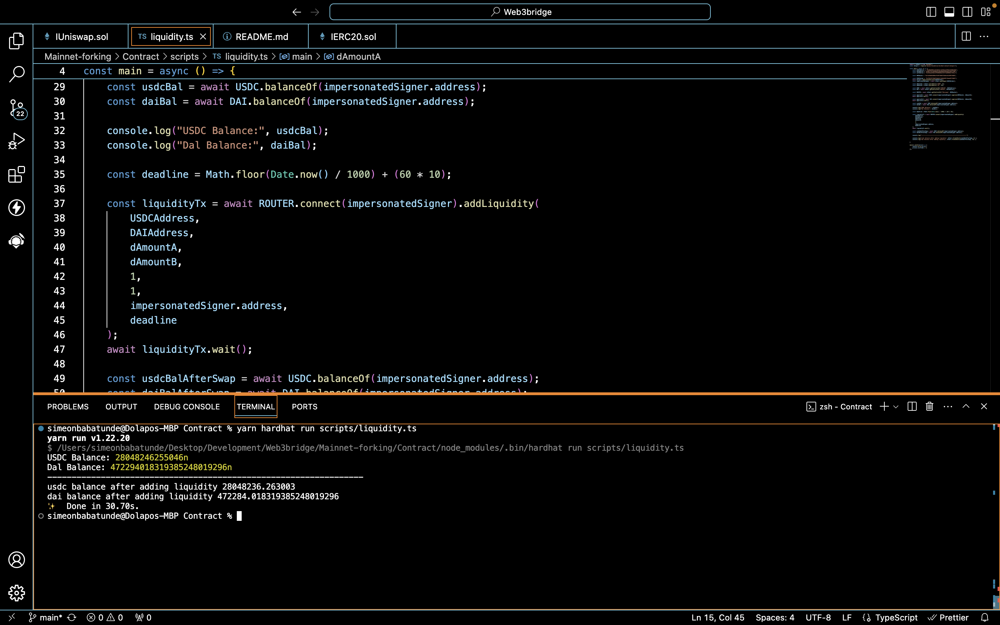
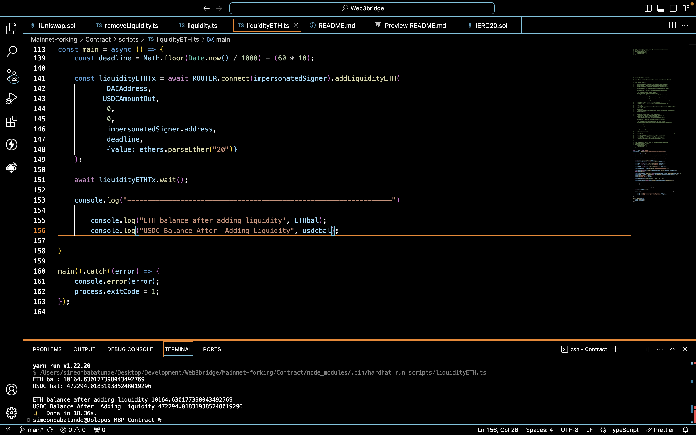

## Mainnet Forking - UniSwap Router2

This project is ascript that interacts with at least two functions on the Uniswap router contract.

## Screenshot 

- Add liquidity

## Transaction Hash for Factory Contract

- 0x641fda3491b6408b5b3dac83d0c2f98f79a938e5464ec48daf029bec2b81719f
